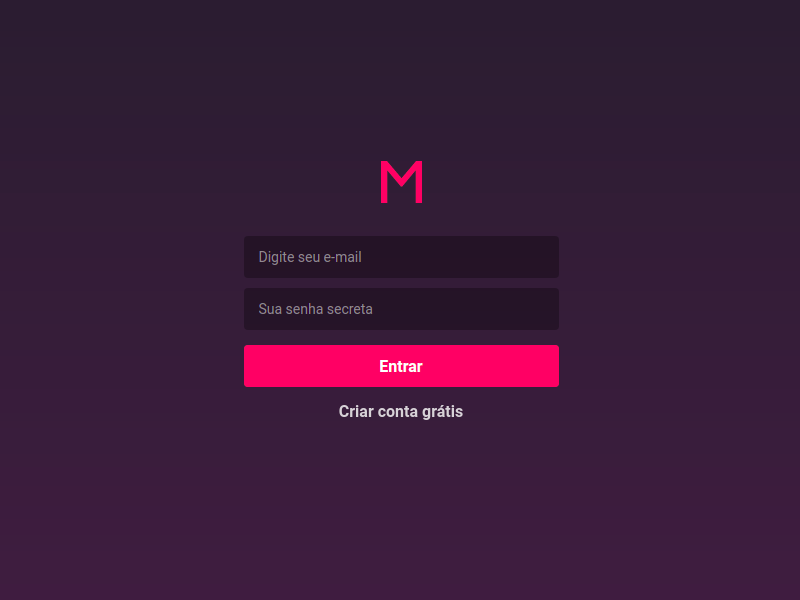
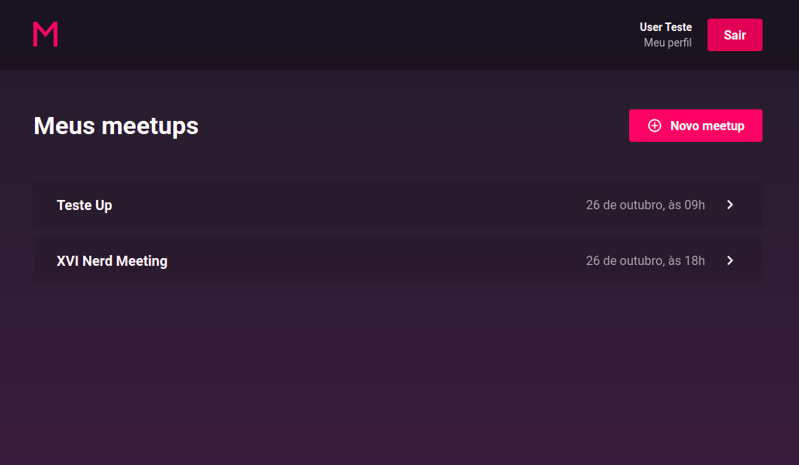
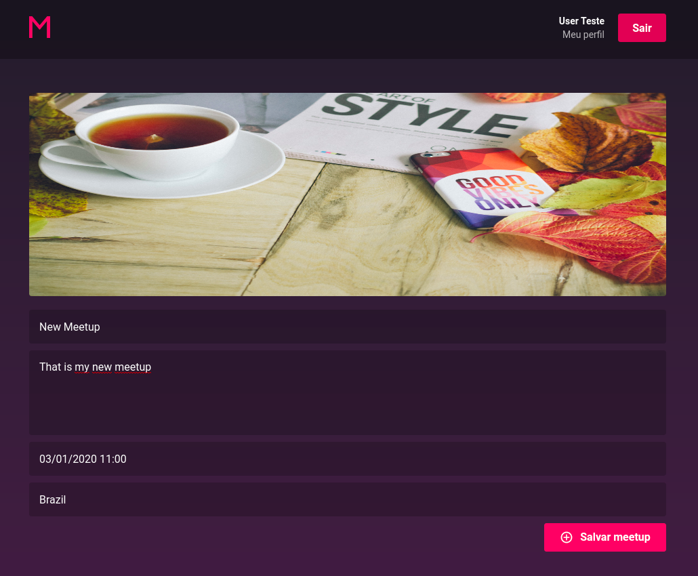
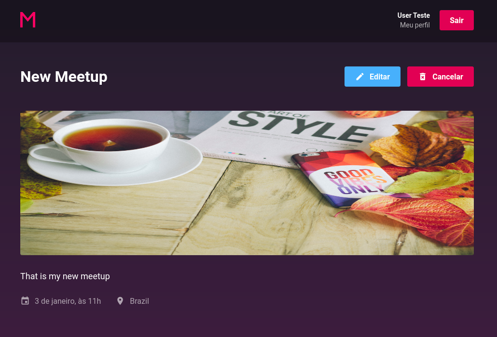
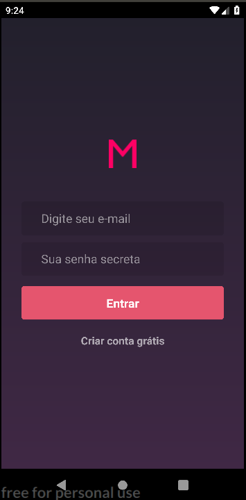
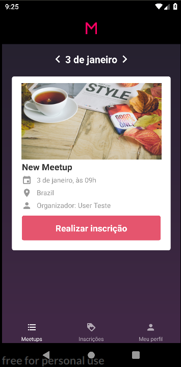
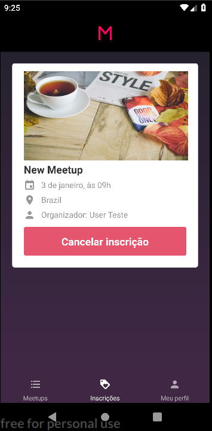
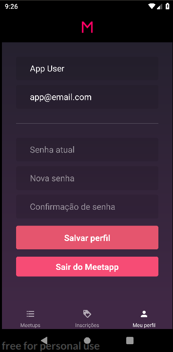

<h1 align="center">
    FINAL CHALLENGE - MEETAPP
</h1>

<h3 align="center">
  Meetapp is a developer event aggregator app
</h3>

<p align="center">
  
</p>

[RocketSeat GoStack Bootcamp](https://rocketseat.com.br/bootcamp) challenge resolution.

## Application screen

### Frontend

<p align="center">
  
  
  
  
</p>

### Mobile

<p align="center">
  
  
  
  
</p>
---

## Technologies

### Backend

- [Node.js](https://nodejs.org/)
- [Express](https://expressjs.com/)
- [Docker](https://www.docker.com/docker-community)
- [Sequelize](http://docs.sequelizejs.com/)
- [PostgreSQL](https://www.postgresql.org/)
- [Redis](https://redis.io/)
- [Nodemailer](https://nodemailer.com/about/)

### Frontend

- [ReactJS](https://reactjs.org/)
- [Redux](https://redux.js.org/)
- [Redux-Saga](https://redux-saga.js.org/)
- [React-Router](https://github.com/ReactTraining/react-router)
- [Reactotron](https://infinite.red/reactotron)

### Mobile

- [ReactJS](https://reactjs.org/)
- [React Native](https://facebook.github.io/react-native/)
- [Redux](https://redux.js.org/)
- [Redux-Saga](https://redux-saga.js.org/)
- [Reactotron](https://infinite.red/reactotron)

## Run

For the entire application to work correctly it is recommended that the following tools are installed at least in versions:

- Git -> 2.17.1
- NodeJS -> 10.16.3
- Yarn -> 1.19.1
- Docker -> 19.03.4

### Backend

```bash
# PostgreSQL docker
$ docker run --name database -e POSTGRES_PASSWORD=docker -e POSTGRES_DB=meetapp -p 5432:5432 -d postgres

# Redis docker
$ docker run --name redis -p 6379:6379 -d -t redis:alpine

# After clone the project
$ cd meetapp/meetapp_backend

# Install packages
$ yarn install

# Create a root .env file in the project containing the settings of Redis, PostgreSQL, etc.
# You can follow env.example as an example

# Creating DB tables
$ yarn sequelize db:migrate

# Running in dev mode
$ yarn dev
```

The application will be available at: _http://localhost:3333_

### Frontend

```bash
$ cd meetapp/meetapp_frontend

# Install packages
$ yarn install

# Running in dev mode
$ yarn start
```

The application will automatically open in your default browser on: _http://localhost:3000_

### Mobile

_Note.: this app has not been tested on iOS device_

```bash
$ cd meetapp/meetapp_mobile

# Install packages
$ yarn install

# Running Metro Bundler
$ yarn start

# and in another terminal in the project folder -> you need an Android device or emulador installed
$ yarn android
```

---

This is part of my [GoStack](https://rocketseat.com.br/bootcamp) training :green_heart:
